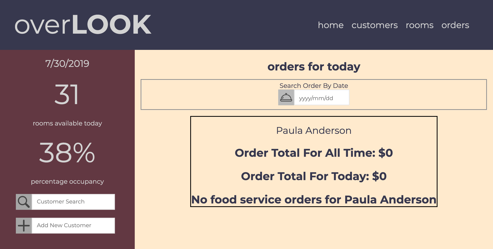

# Overlook

Overlook, a hotel management application, targets hotel managers interested in keeping tabs on their hotel's bookings, customers, room service orders, and more. 

## Setup

1. Clone the repo.
1. Install the application's dependencies from within the cloned directory:

```bash
npm install
```

## Testing

Should you be so inclined to test the program, simply run the test suite using the command:

```bash
npm test
```

The test results will output to the terminal.

### Developer

- Alyssa Lundgren [@lundgrea](https://github.com/lundgrea)


### ScreenShots HTML





### Icon Credits

<div>Icons made by <a href="https://www.flaticon.com/authors/srip" title="srip">srip</a> from <a href="https://www.flaticon.com/"                 title="Flaticon">www.flaticon.com</a> is licensed by <a href="http://creativecommons.org/licenses/by/3.0/"                 title="Creative Commons BY 3.0" target="_blank">CC 3.0 BY</a></div>

<div>Icons made by <a href="https://www.flaticon.com/authors/egor-rumyantsev" title="Egor Rumyantsev">Egor Rumyantsev</a> from <a href="https://www.flaticon.com/"                 title="Flaticon">www.flaticon.com</a> is licensed by <a href="http://creativecommons.org/licenses/by/3.0/"                 title="Creative Commons BY 3.0" target="_blank">CC 3.0 BY</a></div>

<div>Icons made by <a href="https://www.flaticon.com/authors/freepik" title="Freepik">Freepik</a> from <a href="https://www.flaticon.com/"                 title="Flaticon">www.flaticon.com</a> is licensed by <a href="http://creativecommons.org/licenses/by/3.0/"                 title="Creative Commons BY 3.0" target="_blank">CC 3.0 BY</a></div>

<div>Icons made by <a href="https://www.flaticon.com/authors/those-icons" title="Those Icons">Those Icons</a> from <a href="https://www.flaticon.com/"                 title="Flaticon">www.flaticon.com</a> is licensed by <a href="http://creativecommons.org/licenses/by/3.0/"                 title="Creative Commons BY 3.0" target="_blank">CC 3.0 BY</a></div>

